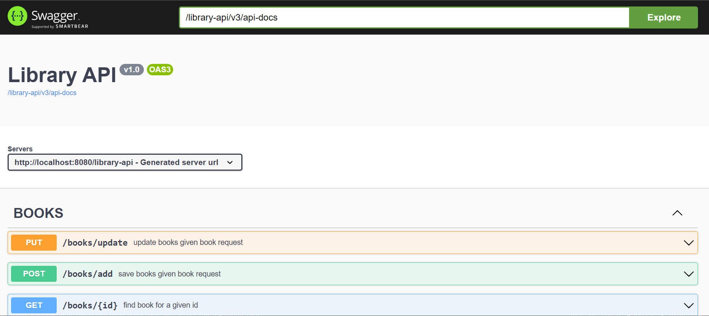
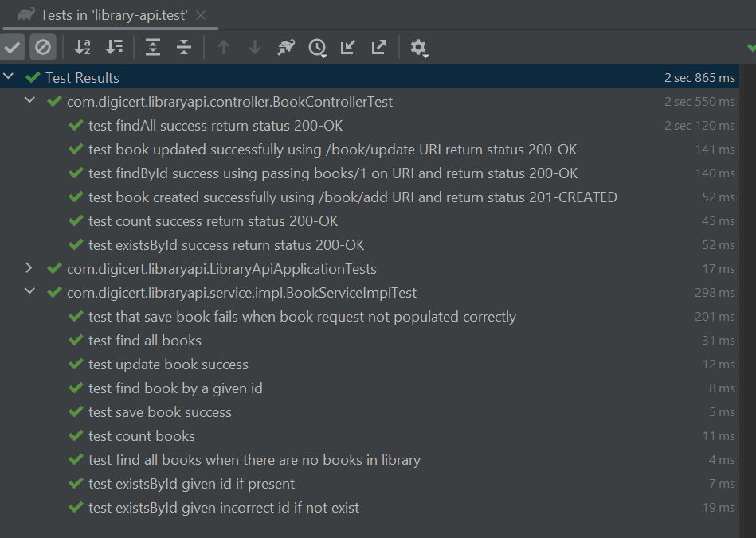

# Digicert RESTful library API

1.       List all books in the library

2.       CRUD operations on a single book

> API documentation available at http://localhost:8080/library-api/swagger-ui/index.html#/ after starting the app
   

### Pre-Requirements
- [jdk11](https://www.oracle.com/technetwork/java/javase/downloads/jdk11-downloads-5066655.html)
- [gradle](https://gradle.org/)

## Tech stack
- Spring Boot (web)
- H2 inMemory DB

### Test
- `./gradlew test`

### Build 
- `./gradlew build`

### Start app
- `./gradlew bootRun`

>UNIT tests can be found under src/test
  

### Decisions
I opted to use H2 inmemory DB mainly because it is quick to setup and does not require db installation to start 

I also used SOLID principles and good code patterns, and for unit tests I decided to use mainly mockito without spring runner for fast test startup.

### Future Steps
- Use real cloud DB
- Apply CI/CD pipeline